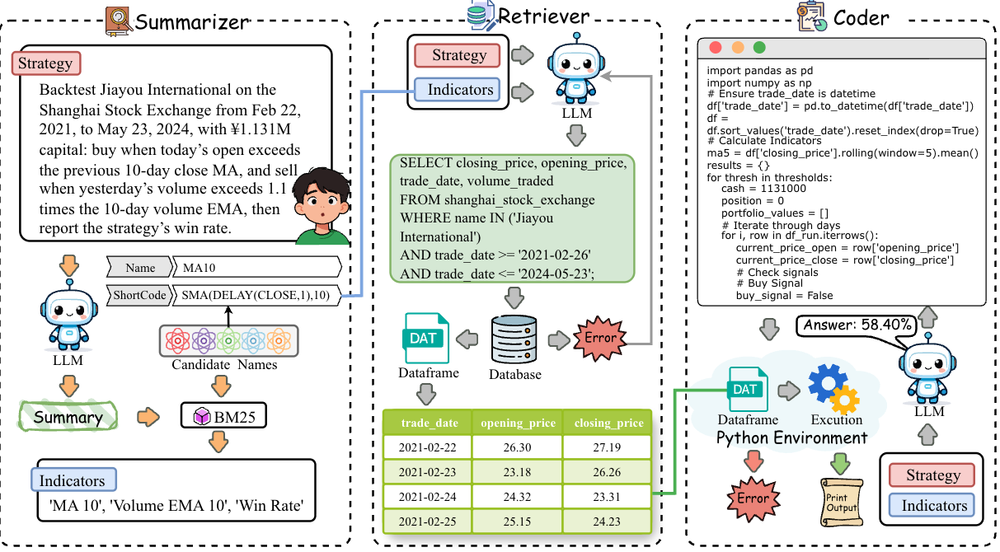

## :boom: This work has been accepted for publication in KDD-2026.

This repository is currently under active development. We are continuously working on improving the visual presentation and optimizing the code. If you have any questions, please feel free to open an issue.

---

## Overall framework of the AutoBacktest.



*This figure is currently being further optimized.*

---

### Model Performance on BacktestBench

This table reports model performance on the synthetic BacktestBench dataset and excludes results from the expert-crafted subset.  
**OA** denotes the overall performance aggregated across task categories.  
Abbreviations: **MC**: Metrics Calculation, **TS**: Ticker Selection, **PC**: Parameter Confirmation, **SS**: Strategy Selection, **ECR**: Execution Correctness Rate, **EA**: Execution Accuracy.

*More model results will be continuously updated in future releases.*

#### Open-Source Large Language Models

| Model | Back Test OA | MC | TS | PC | SS | SQL ECR | SQL EA | Factor Acc | P | R | F1 |
|---|---:|---:|---:|---:|---:|---:|---:|---:|---:|---:|---:|
| Qwen3.5 397B | 60.25 | 41.82 | 84.59 | 80.41 | 86.70 | 100.00 | 98.62 | 80.27 | 95.02 | 96.53 | 95.77 |
| Qwen3.5 122B | 45.41 | 21.93 | 77.85 | 69.96 | 78.15 | 99.53 | 92.57 | 81.23 | 95.34 | 96.58 | 95.95 |
| Qwen3 235B | 55.01 | 34.71 | 82.26 | 75.93 | 85.04 | 100.00 | 97.11 | 76.41 | 93.62 | 94.75 | 94.18 |
| Qwen3 Next 80B | 44.06 | 26.02 | 67.40 | 65.86 | 68.17 | 99.92 | 94.79 | 73.80 | 92.57 | 94.54 | 93.54 |
| Qwen3 32B | 47.81 | 27.93 | 75.93 | 70.34 | 72.21 | 100.00 | 90.72 | 67.41 | 90.44 | 93.99 | 92.18 |
| Qwen3 30B | 47.03 | 28.67 | 71.25 | 65.86 | 75.06 | 99.97 | 92.86 | 69.73 | 91.78 | 93.25 | 92.51 |
| Qwen3 14B | 36.97 | 16.96 | 62.04 | 61.57 | 64.61 | 99.95 | 87.59 | 60.92 | 87.56 | 90.50 | 89.01 |
| Qwen3 8B | 26.36 | 4.93 | 53.92 | 50.56 | 57.48 | 99.97 | 86.89 | 60.61 | 87.33 | 90.66 | 88.96 |
| Qwen3 4B | 19.63 | 1.77 | 39.06 | 42.54 | 48.22 | 98.85 | 69.94 | 58.34 | 87.16 | 89.84 | 88.48 |
| Seed OSS 36B | 11.34 | 4.60 | 20.08 | 13.06 | 28.50 | 91.16 | 87.96 | 68.07 | 90.49 | 91.89 | 91.18 |
| Hy3 Preview | 54.98 | 35.32 | 82.39 | 75.00 | 82.66 | 99.95 | 94.47 | 63.43 | 87.63 | 95.85 | 91.55 |
| Ministral 3 14B | 26.98 | 7.76 | 47.73 | 50.93 | 58.91 | 97.18 | 72.26 | 59.62 | 86.77 | 90.75 | 88.71 |
| Ministral 3 8B | 17.26 | 2.83 | 34.11 | 37.31 | 36.34 | 92.23 | 46.35 | 47.99 | 82.20 | 87.69 | 84.86 |
| Gemma 4 31B | 64.29 | 51.86 | 80.19 | 78.92 | 81.71 | 100.00 | 98.72 | 74.22 | 93.23 | 95.95 | 94.57 |
| Gemma 4 26B | 62.43 | 44.47 | 87.62 | 81.34 | 86.70 | 100.00 | 91.53 | 63.95 | 87.62 | 94.83 | 91.08 |
| Gemma 4 E4B | 16.01 | 2.60 | 31.09 | 30.41 | 40.14 | 99.11 | 59.72 | 59.20 | 87.01 | 91.72 | 89.30 |
| Kimi K2 Thinking | 44.97 | 30.02 | 66.57 | 58.02 | 67.46 | 98.20 | 96.06 | 79.82 | 95.09 | 96.86 | 95.96 |
| Kimi Linear 48B | 4.87 | 0.19 | 10.18 | 8.58 | 14.96 | 99.22 | 48.46 | 74.37 | 79.38 | 82.05 | 80.69 |
| GLM 5 | 62.85 | 46.61 | 85.14 | 81.16 | 84.09 | 99.95 | 98.67 | 83.68 | 96.22 | 96.70 | 96.46 |
| GLM 4.7 | 56.83 | 39.13 | 80.33 | 77.24 | 80.76 | 99.92 | 94.86 | 74.35 | 93.48 | 94.53 | 94.00 |
| GLM 4.7 Flash | 20.26 | 4.41 | 47.59 | 37.31 | 32.30 | 97.81 | 56.80 | 56.18 | 88.03 | 90.80 | 89.39 |
| MiniMax M2.7 | 47.18 | 22.07 | 82.26 | 73.13 | 81.95 | 100.00 | 94.50 | 66.42 | 90.95 | 94.27 | 92.58 |
| MiniMax M2.5 | 47.11 | 23.47 | 81.84 | 70.52 | 78.15 | 100.00 | 96.01 | 69.37 | 91.49 | 95.03 | 93.22 |
| MiniMax M2.1 | 45.91 | 21.98 | 81.71 | 69.22 | 76.72 | 99.56 | 95.02 | 57.09 | 86.65 | 90.76 | 88.66 |
| GPT OSS 120B | 49.56 | 30.86 | 74.00 | 70.34 | 76.48 | 99.43 | 96.58 | 67.65 | 90.46 | 93.35 | 91.88 |
| GPT OSS 20B | 33.13 | 17.33 | 51.17 | 49.44 | 62.00 | 94.34 | 90.56 | 67.54 | 90.86 | 92.76 | 91.80 |
| Mimo V2 Flash | 40.43 | 17.43 | 73.04 | 64.37 | 71.26 | 97.84 | 80.42 | 58.58 | 86.67 | 93.38 | 89.90 |
| Deepseek V3.2 | 50.70 | 29.18 | 79.78 | 73.51 | 81.47 | 99.97 | 92.86 | 68.98 | 91.01 | 94.88 | 92.90 |

#### Closed-Source Large Language Models

| Model | Back Test OA | MC | TS | PC | SS | SQL ECR | SQL EA | Factor Acc | P | R | F1 |
|---|---:|---:|---:|---:|---:|---:|---:|---:|---:|---:|---:|
| Gemini 3 Pro | 67.41 | 51.67 | 90.37 | 82.46 | 89.07 | 99.64 | 98.70 | 87.15 | 96.08 | 96.07 | 96.08 |
| Qwen3 Max | 61.84 | 44.14 | 85.56 | 82.28 | 85.27 | 100.00 | 94.73 | 72.42 | 91.75 | 95.82 | 93.74 |
| Qwen3 Coder Plus | 42.05 | 20.59 | 63.41 | 71.08 | 77.91 | 99.95 | 94.03 | 65.09 | 89.94 | 94.24 | 92.04 |
| Seed 1.8 | 60.58 | 43.22 | 85.83 | 77.05 | 84.80 | 99.40 | 97.45 | 76.93 | 94.27 | 96.24 | 95.25 |


---

## Overview

This project provides a script to run the model service with configurable parameters. Follow the steps below to set up the environment, install dependencies, start the necessary database container, and execute the script.

---

## Prerequisites

* [Conda](https://docs.conda.io/en/latest/) installed on your system.
* A valid API key for accessing the model backend service.
* [Docker](https://docs.docker.com/) installed and running.

---

## Database Setup

Before running the prediction script, you need to start a PostgreSQL container using Docker and load all the necessary tables into it.

1. **Start the PostgreSQL container**:

   ```bash
   docker run -id \
     --name=quant \
     -v ./data:/var/lib/postgresql/data \
     -p 5432:5432 \
     -e POSTGRES_PASSWORD='123456' \
     -e POSTGRES_USER='quant' \
     -e LANG=C.UTF-8 \
     --restart=always \
     postgres:alpine
   ```
After successful execution, the database will be accessible via port 5432.

2. **Import all tables into the database**:

   The automation script for importing tables is provided as a Python notebook. Run it to populate the database:

   ```bash
   tables/import_tables.ipynb
   ```

---

## Installation

1. Create and activate a Conda environment:

   ```bash
   conda create -n quant python=3.11.14  -y
   conda activate quant
   ```

2. Install required Python packages from `requirements.txt`:

   ```bash
   pip install -r requirements.txt
   ```

---

## Reproduction

To reproduce the results, run the following command:

```bash
bash run.sh MODEL_NAME WORKERS BASE_URL API_KEY
```

**Parameter order is important and must be provided exactly as shown above.**

### Parameters

1. **MODEL\_NAME**: The name or identifier of the model you want to serve.

   * Example: `qwen3-8b`, `qwen3-235b`

2. **WORKERS**: The number of worker processes to spawn for handling requests.

   * Example: `4`, `8`

3. **BASE\_URL**: The base URL of the model backend service.

   * Example: `http://localhost:8000`, `https://api.yourmodel.com`

4. **API\_KEY**: Your API key for authenticating with the model backend.

   * Example: `sk-XXXXXXXXXXXXXXXXXXXX`

---

## Example

```bash
bash run.sh qwen3-235b 4 http://localhost:8000 sk-1234567890abcdef
```

This will start the prediction using the `qwen3-235b` model with 4 worker processes, connecting to `http://localhost:8000` using the provided API key.


## Citation
If you found this work useful for you, please consider citing it.
```
@inproceedings{
kdd2026backtestbench,
title={{BacktestBench}: Benchmarking Large Language Models for Automated Quantitative Strategy Backtesting},
author={Zhensheng Wang and Wenmian Yang and Qingtai Wu and Lequan Ma and Yiquan Zhang and Weijia Jia},
booktitle={Proceedings of the 32nd ACM SIGKDD Conference on Knowledge Discovery and Data Mining V.2 (KDD 2026), August 9--13, 2026, Jeju Island, Republic of Korea},
year={2026},
isbn = {979-8-4007-2259-2/2026/08},
publisher = {Association for Computing Machinery},
address = {New York, NY, USA},
doi={10.1145/3770855.3817460},
url={https://arxiv.org/abs/2605.17937}
}
```